# FixHub 🛠️

**On-Demand Home Services Marketplace — Desktop Application**

FixHub is a C# WinForms desktop application that connects customers with verified home-service providers (plumbers, electricians, cleaners, AC technicians, and more) for on-demand booking, scheduling, and payment. The platform runs on a three-tier role system — **Customer**, **Admin (Service Provider)**, and **SuperAdmin (Platform Owner)** — and generates revenue through a commission model on every completed booking.

This project was built as the final project for **CSC 2210 — Object-Oriented Programming II**.

---

## Table of Contents

- [Team](#team)
- [Overview](#overview)
- [Screenshots](#screenshots)
- [Key Features](#key-features)
- [Tech Stack](#tech-stack)
- [System Architecture](#system-architecture)
- [UI Navigation Flow](#ui-navigation-flow)
- [Project Structure](#project-structure)
- [Database Schema](#database-schema)
- [Getting Started](#getting-started)
  * [Prerequisites](#prerequisites)
  * [Installation & Setup](#installation--setup)
  * [Default Login Credentials](#default-login-credentials)
- [Usage Guide](#usage-guide)
- [Security Notes](#security-notes)
- [Known Limitations](#known-limitations)
- [Roadmap](#roadmap)
- [Contributing](#contributing)
- [License](#license)

---

## Team
 
| Name | Student ID | Contribution |
| ---- | ---------- | ------------- |
| Awlad Hossain Abir | 24-60107-3 | e.g. Customer module, database schema (50%) |
| Sheikh Al Fattah | 24-60103-3 | e.g. Admin side, reports (25%) |
| Adib Rahman | 24-57433-2 | e.g. SuperAdmin side, testing (25%) |
 
---

## Overview

FixHub solves the fragmented, word-of-mouth nature of finding reliable home-service providers by putting customers, providers, and platform administrators into one managed workflow:

- **Customers** browse verified providers by category, book a service, pay online or on completion, and leave a review.
- **Admins (Providers)** manage their profile, availability, and pricing, and process incoming job requests from acceptance to completion.
- **SuperAdmins** oversee the entire platform — approving new providers, managing service categories, resolving customer complaints, and reviewing platform-wide financial reports.

The project was deliberately scoped as a services marketplace (rather than a more common inventory/e-commerce CRUD app) to demonstrate a richer domain model: multi-role authentication, booking state machines, commission-based payments, and a review/rating system.

---

## Screenshots

### Customer
 
| Login | Sign Up |
| ----- | ------- |
| .png) | 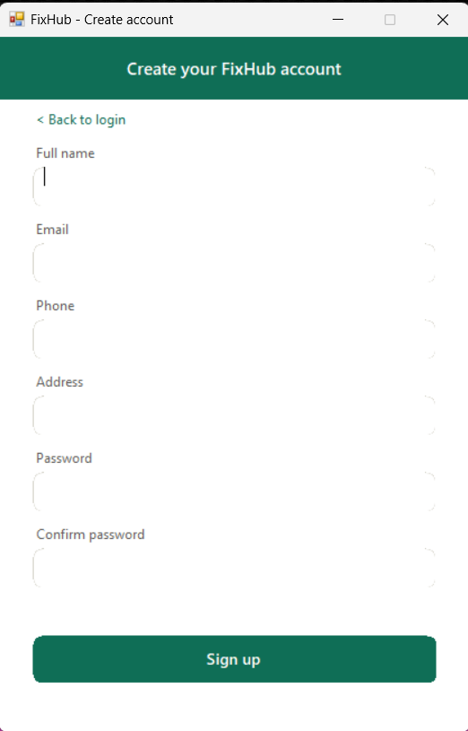 |
 
| Customer Dashboard | Browse Providers |
| ------------------- | ----------------- |
| 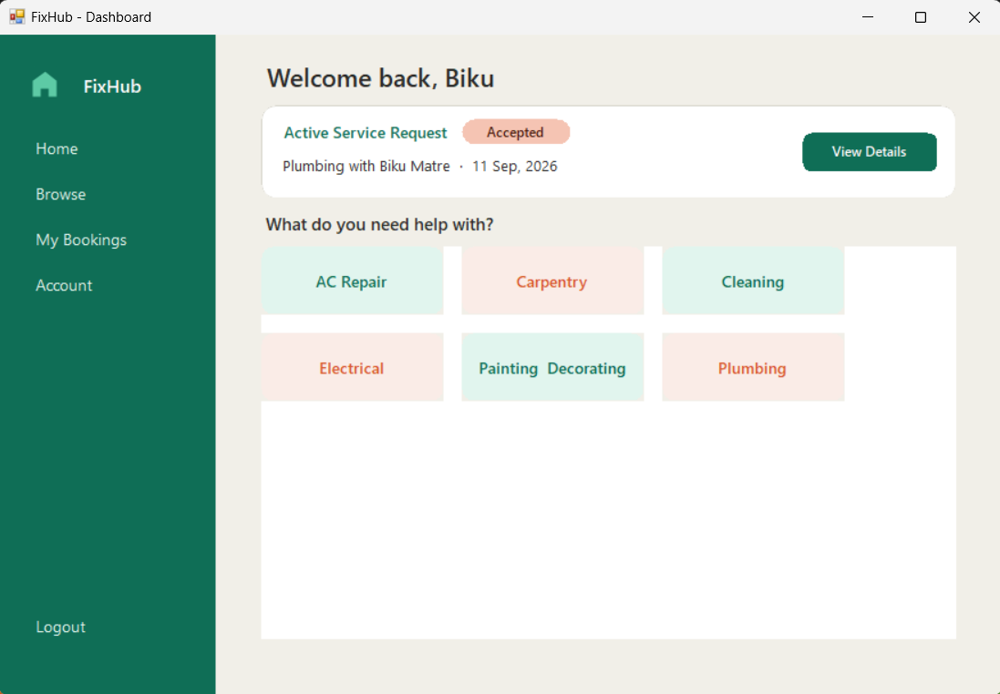 | 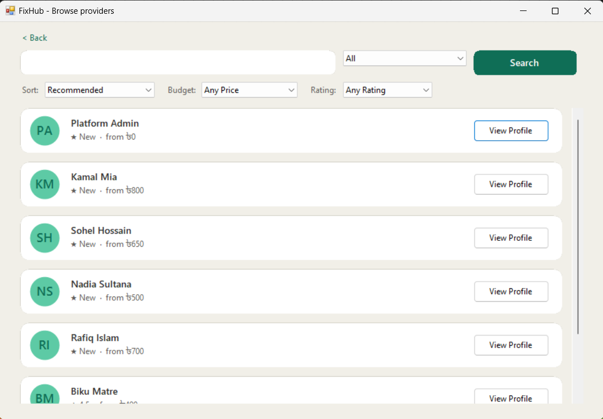 |
 
| Provider Profile | Book & Pay |
| ----------------- | ---------- |
| 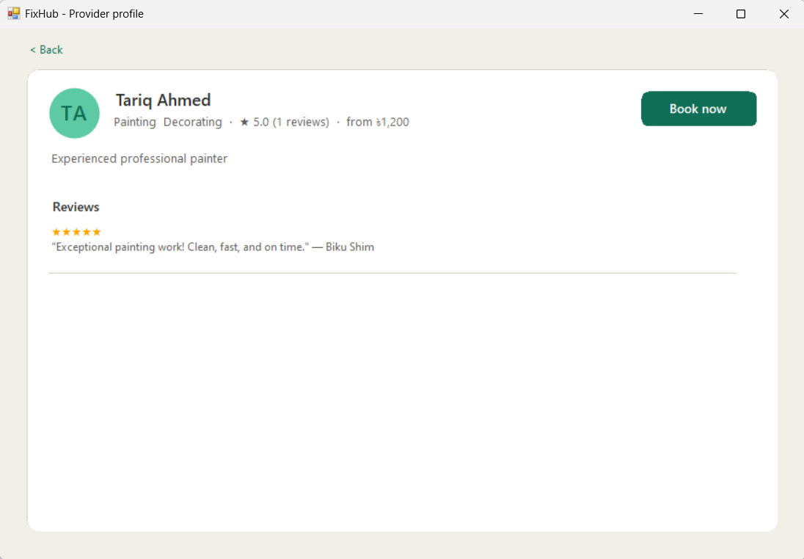 |  |
 
| My Bookings | Leave a Review |
| ----------- | --------------- |
| 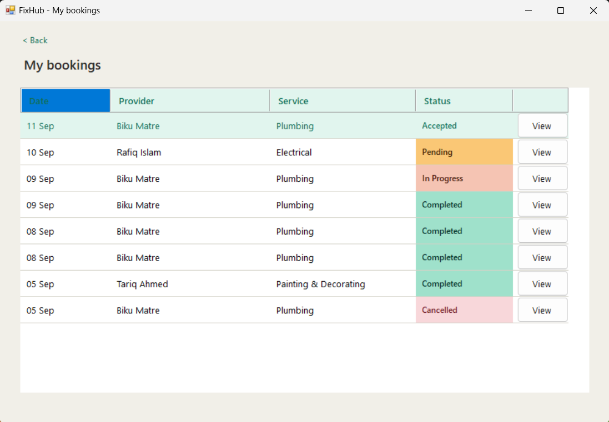 | 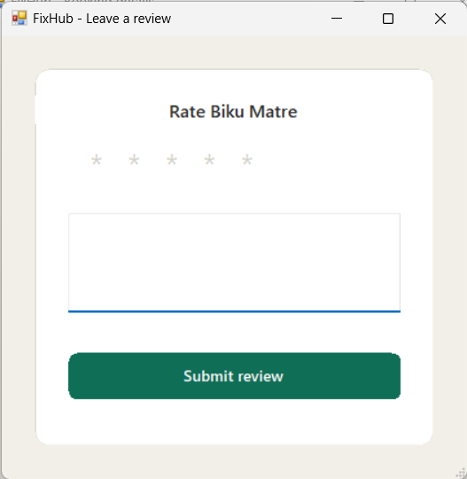 |
 
### Admin (Service Provider)
 
| Admin Dashboard | Manage Requests |
| ---------------- | ---------------- |
| 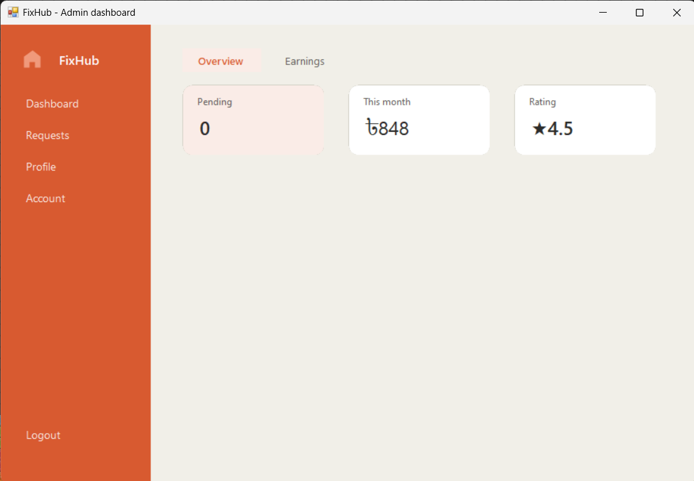 | 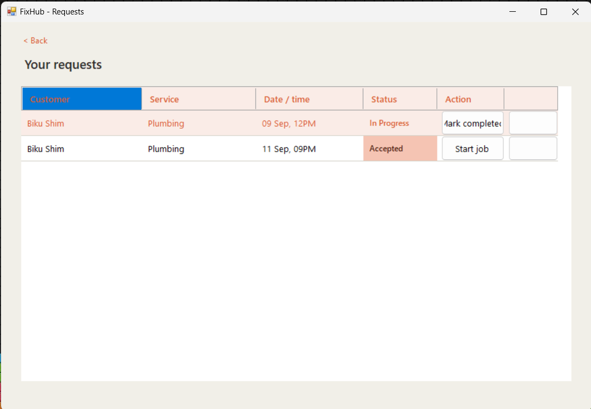 |
 
### SuperAdmin
 
| SuperAdmin Dashboard | Manage Admins |
| ---------------------- | -------------- |
| 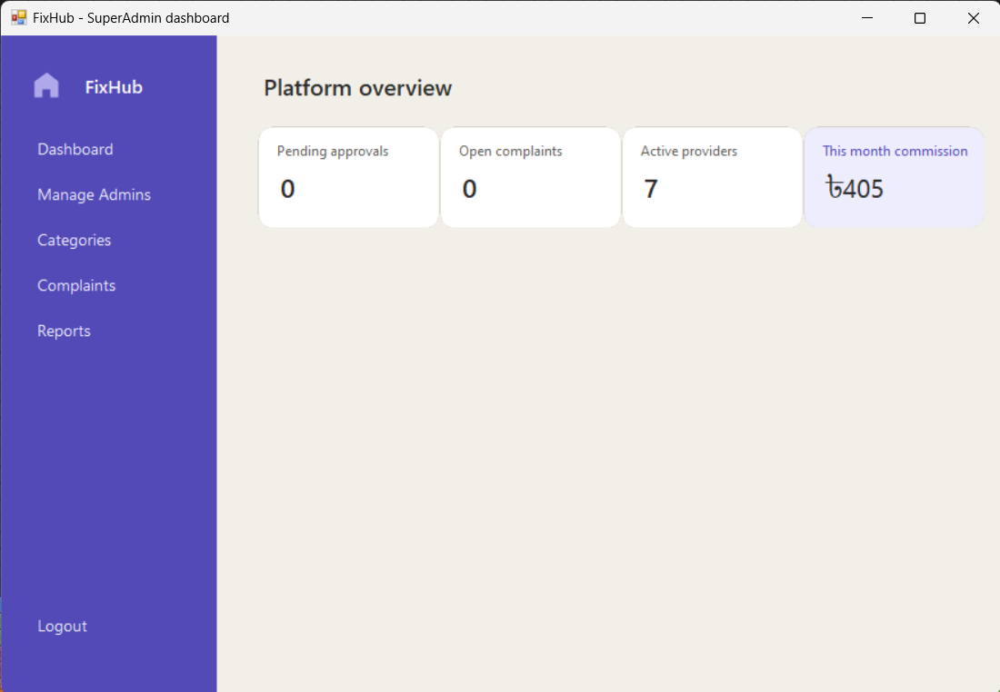 | 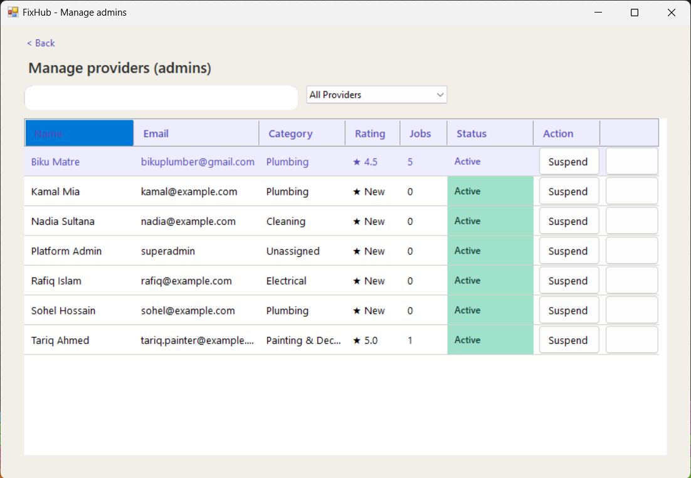 |
 
| Reports (Commission) |
| ---------------------- |
| .png) |
 
---
<!--
Add any additional screens below as needed, e.g.:


-->

---

## Key Features

### 👤 Customer
- Sign up / log in with hashed password authentication
- Browse and filter service providers by category, price, and rating
- View a provider's profile, bio, and reviews before booking
- Book a service with a scheduled date and address, and pay via **Pay Now** or **Pay After**
- Apply discount coupons at checkout
- Track bookings through their full lifecycle (Pending → Accepted → In Progress → Completed / Cancelled / Declined)
- Leave a rating and written review after a completed job
- File a complaint against a booking
- Manage personal account details

### 🧰 Admin (Service Provider)
- Sign up for a provider account (subject to SuperAdmin approval before going live)
- Manage profile: bio, pricing, category, and availability toggle
- View and respond to incoming service requests (accept / decline / update status)
- Track job history and completed bookings
- View ratings and reviews left by customers
- Manage account settings

### 🛡️ SuperAdmin (Platform Owner)
- Secure, separate SuperAdmin login (auto-provisioned on first run — see [Default Login Credentials](#default-login-credentials))
- Approve, suspend, or reinstate service providers
- Create and manage service categories
- View and resolve customer complaints with resolution notes
- Generate platform-wide reports (bookings, revenue, commission earned)
- Manage other Admin/SuperAdmin accounts

---

## Tech Stack

| Layer | Technology |
|---|---|
| Language | C# (.NET Framework 4.8) |
| UI Framework | Windows Forms (WinForms) |
| Database | Microsoft SQL Server / LocalDB |
| Data Access | ADO.NET (`System.Data.SqlClient`) via a lightweight `DbHelper` |
| Password Security | Custom `PasswordHasher` (salted hashing) |
| IDE | Visual Studio 2022+ |

No external NuGet packages or ORMs are required — data access is handled directly through ADO.NET helper classes, keeping the project dependency-free and easy to run on any machine with Visual Studio and SQL Server LocalDB.

---

## System Architecture

FixHub follows a simple layered structure typical of a WinForms line-of-business app:

```
┌─────────────────────────────┐
│        Presentation         │   frmLogin, frmCustomerDashboard,
│      (WinForms — Forms)     │   frmAdminDashboard, frmSuperAdminDashboard, ...
└──────────────┬───────────────┘
               │
┌──────────────▼───────────────┐
│           Helpers            │   DbHelper (ADO.NET wrapper)
│    (Helpers/ + root utils)   │   PasswordHasher, DatabaseInitializer,
│                               │   InputBoxHelper, UIHelper
└──────────────┬───────────────┘
               │
┌──────────────▼───────────────┐
│      SQL Server / LocalDB    │   Customers, Admins, Bookings, Payments,
│                               │   Reviews, Complaints, Coupons, SuperAdmins,
│                               │   ServiceCategories
└───────────────────────────────┘
```

On startup, `Program.cs` calls `DatabaseInitializer.EnsureSuperAdminReady()`, which idempotently applies any missing schema changes and guarantees a default SuperAdmin account exists before the login form loads.

---

## UI Navigation Flow
 
> **TODO:** This diagram is inferred from the form names in the project structure below — double-check it matches your actual navigation and adjust as needed.
 
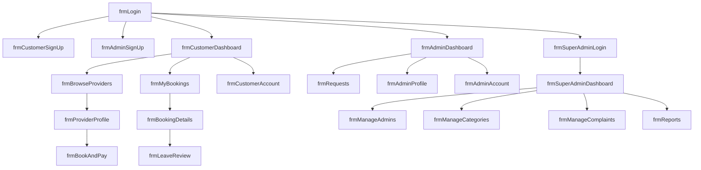
 
---

## Project Structure

```
FixHub/
├── FixHub.slnx                     # Visual Studio solution
├── database/
│   └── schema.sql                  # Full DB schema (tables, views, seed data)
├── fixhub_schema.sql                # Schema copy at repo root
└── FixHub/                          # Main WinForms project
    ├── Program.cs                   # App entry point
    ├── App.config                   # Connection string & runtime config
    ├── FixHub.csproj
    │
    ├── frmLogin.cs / .Designer.cs                 # Shared login screen
    ├── frmCustomerSignUp.cs / frmAdminSignUp.cs   # Registration flows
    ├── frmSuperAdminLogin.cs                      # SuperAdmin-only login
    │
    ├── frmCustomerDashboard.cs                    # Customer home
    ├── frmBrowseProviders.cs                      # Provider search/filter
    ├── frmProviderProfile.cs                      # Provider detail view
    ├── frmBookAndPay.cs                           # Booking + payment flow
    ├── frmMyBookings.cs / frmBookingDetails.cs     # Booking tracking
    ├── frmLeaveReview.cs                           # Post-service review
    ├── frmCustomerAccount.cs                       # Customer profile settings
    │
    ├── frmAdminDashboard.cs                        # Provider home
    ├── frmRequests.cs                              # Incoming job requests
    ├── frmAdminProfile.cs / frmAdminAccount.cs      # Provider profile/settings
    │
    ├── frmSuperAdminDashboard.cs                    # Platform admin home
    ├── frmManageAdmins.cs                            # Approve/suspend providers
    ├── frmManageCategories.cs                        # Service category CRUD
    ├── frmManageComplaints.cs                        # Complaint resolution
    ├── frmReports.cs                                  # Revenue/booking reports
    │
    ├── Helpers/
    │   ├── DbHelper.cs               # ADO.NET query/execute wrapper
    │   ├── DatabaseInitializer.cs    # Startup schema + seed guarantees
    │   └── PasswordHasher.cs         # Salted password hashing
    ├── InputBoxHelper.cs             # Reusable input dialog
    ├── UIHelper.cs                   # Shared UI/styling utilities
    └── Properties/                   # Assembly info & settings
```

---

## Database Schema

The database (`FixHubDb`) is created and versioned via [`database/schema.sql`](database/schema.sql), which is safe to re-run (all statements are guarded with `IF NOT EXISTS` checks).
 
**Core tables:**
 
| Table               | Key Columns                                                                                              | Purpose                                                                          |
| ------------------- | --------------------------------------------------------------------------------------------------------- | --------------------------------------------------------------------------------- |
| `ServiceCategories` | `CategoryId` PK, `CategoryName` (unique)                                                                  | Lookup table for service types (Plumbing, Electrical, Cleaning, AC Repair, ...)  |
| `Customers`         | `CustomerId` PK, `Name`, `Email` (unique), `Phone`, `Address`, `PasswordHash`, `CreatedAt`                 | Customer accounts and profile info                                               |
| `Admins`            | `AdminId` PK, `CategoryId` FK, `Name`, `Email` (unique), `Phone`, `Price`, `Bio`, `PasswordHash`, `IsApproved`, `IsSuspended`, `IsAvailable`, `Rating`, `CreatedAt` | Service provider accounts — category, pricing, approval/suspension state, rating |
| `Bookings`          | `BookingId` PK, `CustomerId` FK, `AdminId` FK, `ServiceName`, `ScheduledDate`, `Address`, `Status` (checked), `CreatedAt` | Service requests linking a customer to a provider, with a status state machine   |
| `Payments`          | `PaymentId` PK, `BookingId` FK, `Amount`, `CommissionAmount`, `PaymentStatus`, `PaymentMethod`, `CreatedAt` | Payment amount, commission split, method, and status per booking                 |
| `Reviews`           | `ReviewId` PK, `BookingId` FK, `CustomerId` FK, `AdminId` FK, `Rating` (1–5, checked), `Comment`, `CreatedAt` | Ratings and comments left by customers, linked back to both the booking and the provider |
| `SuperAdmins`       | `SuperAdminId` PK, `Username` (unique), `PasswordHash`, `CreatedAt`                                        | Platform-owner accounts                                                          |
| `Complaints`        | `ComplaintId` PK, `BookingId` FK, `Description`, `Status`, `ResolutionNotes`, `ResolvedBySuperAdminId`, `ResolvedAt`, `CreatedAt` | Customer complaints tied to a booking, with resolution tracking                  |
| `Coupons`           | `CouponId` PK, `Code` (unique), `DiscountPercent`, `ExpiryDate`, `UsageLimit`, `UsedCount`, `IsActive`     | Discount codes with usage limits and expiry (applied at checkout, not stored as a booking FK) |
 
**Helper views:**
 
- `vw_ProviderDetails` — providers joined with category name and completed-job count
- `vw_BookingDetails` — bookings joined with customer, provider, and payment info
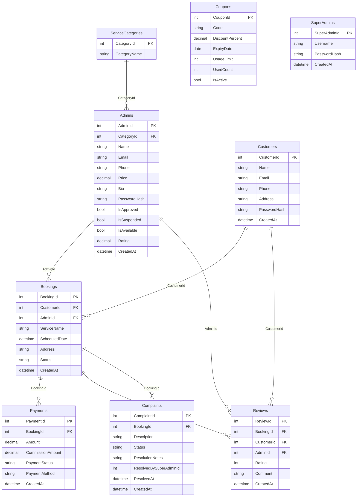
 
> **Note:** `Coupons` has no foreign key column on `Bookings` — coupon codes are validated and applied at checkout time (discount reflected in `Payments.Amount`) rather than stored as a direct relationship. `Complaints.ResolvedBySuperAdminId` is populated by application logic but is not an enforced foreign key in the schema.
 
**Booking status flow:**
 
```
Pending → Accepted → In Progress → Completed
                 └──→ Declined
Pending/Accepted → Cancelled
```
 
**Sample reporting query:**
 
Used by the SuperAdmin Reports screen — a multi-table `JOIN` combined with `GROUP BY` and the `SUM` aggregate function to calculate total commission earned per service category from completed bookings:
 
```sql
SELECT
    ISNULL(c.CategoryName, 'Other') AS CategoryName,
    ISNULL(SUM(p.CommissionAmount), 0) AS TotalCommission
FROM Bookings b
JOIN Payments p ON b.BookingId = p.BookingId
JOIN Admins a ON b.AdminId = a.AdminId
LEFT JOIN ServiceCategories c ON a.CategoryId = c.CategoryId
WHERE b.Status = 'Completed'
GROUP BY c.CategoryName
ORDER BY TotalCommission DESC;
```
 

---

## Getting Started

### Prerequisites

- **Visual Studio 2022** (or later) with the *.NET desktop development* workload
- **.NET Framework 4.8** targeting pack
- **SQL Server LocalDB** (installed automatically with Visual Studio, or via SQL Server Express)
- **SQL Server Management Studio (SSMS)** (optional, for inspecting the database directly)

### Installation & Setup

1. **Clone or extract the project**
   ```bash
   git clone <repository-url>
   cd FixHub
   ```

2. **Open the solution**
   Open `FixHub.slnx` in Visual Studio.

3. **Set up the database**
   - The app is configured to auto-attach a local `FixHubDb.mdf` file next to the executable using the connection string in `App.config`:
     ```
     Data Source=(LocalDB)\MSSQLLocalDB;AttachDbFilename=|DataDirectory|\FixHubDb.mdf;Integrated Security=True;
     ```
   - Alternatively, run [`database/schema.sql`](database/schema.sql) manually in SSMS against a `FixHubDb` database on your SQL Server instance, and update the connection string in `App.config` to point to it.

4. **Build and run**
   - Set `FixHub` as the startup project.
   - Press **F5** / **Start** in Visual Studio.
   - On first launch, `DatabaseInitializer` automatically verifies/creates any missing tables and seeds a default SuperAdmin account.

### Default Login Credentials

A default SuperAdmin account is auto-created on first run:

| Field | Value |
|---|---|
| Username | `superadmin` |
| Password | `FixHub@2026` |

> ⚠️ **Change this password (or regenerate the hash) before any real/shared deployment** — it is hard-coded for local development convenience only.

Customer and Admin (provider) accounts are created through their respective **Sign Up** screens; new provider accounts require SuperAdmin approval before they appear in customer search results.

---

## Usage Guide

1. **As a Customer:** Sign up → browse providers by category → view a provider's profile and reviews → book a service and choose a payment method → track the booking status → leave a review once completed.
2. **As a Provider (Admin):** Sign up → wait for SuperAdmin approval → toggle availability and set pricing → accept/decline incoming requests → update job status through to completion.
3. **As a SuperAdmin:** Log in via the dedicated SuperAdmin login → approve/suspend providers → manage categories and coupons → resolve open complaints → pull reports on bookings and commission revenue.

---

## Security Notes

- Passwords are never stored in plain text — all accounts use salted hashing via `PasswordHasher`.
- Customer, Admin, and SuperAdmin authentication are kept as separate login paths (`frmLogin`, `frmSuperAdminLogin`) to enforce role separation at the entry point.
- All database access uses parameterized queries through `DbHelper` to prevent SQL injection.

---

## Known Limitations

- Built on **.NET Framework 4.8 / WinForms**, so it is Windows-only.
- Uses LocalDB by default, which is intended for development, not multi-user production deployment.
- Payment processing is simulated (Pay Now / Pay After) — no real payment gateway is integrated.
- No automated test suite is currently included.

## Roadmap

- [ ] Add unit tests for booking status transitions and commission calculations
- [ ] Migrate data access to an async pattern / lightweight ORM
- [ ] Add real payment gateway integration
- [ ] Export reports to PDF/Excel
- [ ] Add screenshots (see [Screenshots](#screenshots) section above)

---

## Contributing

This is an academic project built for CSC 2210 (OOP II). Suggestions and pull requests are welcome if you'd like to extend it beyond the course scope.

## License

No license has been specified for this project. All rights reserved by the author unless stated otherwise.
